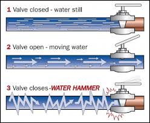

```{r setup, include=FALSE}
knitr::opts_chunk$set(echo = TRUE, cache = T)
library(pacman)
p_load(tidyverse)
p_load(rvest)
p_load(skimr)
p_load(lubridate)
p_load(plotly)
p_load(rpart)
p_load(rpart.plot)
p_load(RCurl)
p_load(Metrics)
p_load(ggrepel)
p_load(ranger)
p_load(fst)
```

## What is a pipeline?

- Focus on pipeline for training and deploying machine-learning models
- Less about moving data than transforming it into desired format
- Still generally expected to 'flow' (be updated)

{ width=65% }


## Why do we need a pipeline?

- Data at source is never ready for use in a model
- New data will arrive
- Need a _repeatable_ process to get it ready
- Want _flexibility_ to engineer new features, exploit new data

{ width=65% }


## What sorts of things are in a pipeline
- creating new variables
- naming variables/levels
- joining data from different sources
- type coercion (dates, factors, booleans, numbers)
- aggregation
- summarisation
- time-binning
- filtering (missing values, unrealistic values)
- imputation
- flagging (of imputed values, coercion etc)
- reshaping  (spreading, gathering, one-hot-encoding)

{ width=65% }
Image Credit: Austin Troya 

## How can this get hard?

In so many ways, it's crazy...

- When to join pipes
- When to narrow pipes
- When to insert reservoirs

```{r democode, eval=F}
### a join
df <- df %>% left_join(other_df, by = "key")

### a narrowing
df <- df %>% 
  select(-bad_variable) %>% 
  filter(some_variable > 0)

### a reservoir
sqlSave(con, df, "TableName", rownames = F, append = T)

```

## How can it get REALLY hard...
- The special problem of water-hammer

{ width=65% }

## Let's start with how it can be easy...

There's the obvious things:

- clean, well-named data
- not too much data
- no missing data
- you know exactly what the use case is 
- no-one else will need the processed data for something else

But the key advantage is:

- Each observation is static (doesn't evolve, order/history doesn't matter)

## ftplanes

```{r ftplanes, echo = TRUE,  warning=F, message=F}
ftplanes <- read_csv("/Users/aidanmorrison/fighterplanes/intdata/ftplanes.csv")
head(ftplanes)
```


## Cutting down ftplanes
```{r, slimplanes, echo = TRUE}
my_skim <- skim(ftplanes) %>% 
  filter(stat == "complete")
good_vars <- my_skim %>% 
  filter(value  > 350) %>% 
  pull(variable)
ftplanes_slim <- ftplanes %>% 
  select(good_vars)
skim(ftplanes_slim)
```

## Modeling most built planes

```{r model, warning=FALSE}
df_train <- ftplanes_slim
mod <- df_train %>% 
  select(-name) %>% 
  rpart(formula = number ~.)
rpart.plot(mod, cex = 0.7, main = "number of fighters built")
```

## How did the model go?
```{r test}
plotcp(mod)
```

## A possible way to improve it - engineer a new feature

```{r timeplot}
ftplanes_slim %>% 
  #filter(country %in% topcountries) %>% 
  ggplot(aes(x = year, y = number, col = status))+
  geom_point(alpha = 0.5)
```

```{r firstfeature, warning=FALSE}
df_train <- ftplanes_slim %>% 
  mutate(ww = case_when((year %in% c(1914:1918) | year %in% c(1939:1945)) ~  TRUE,
                        TRUE ~ FALSE))
df_train %>% 
  select(year, name, ww) %>% 
  head()

mod <- df_train %>% 
  select(-name) %>% 
  rpart(formula = number ~.)
rpart.plot(mod, cex = 0.7, main = "number of fighters built")

```

## The new feature might help...

```{r, checkfeature}
plotcp(mod)
```

Apparently not!

## If we wanted to check properly...

```{r trysample, eval=FALSE}
set.seed(99)
df_train <- sample_frac(ftplanes_slim, .7)
trained <- df_train %>% pull(name)
df_test <- ftplanes_slim %>% filter(!name %in% trained)
mod <- df_train %>% 
  select(-name) %>% 
  rpart(formula = number ~.)
results <- predict(mod, newdata = df_test)

```
We'd get a classic error.

```{r summary}
country_summ <- ftplanes_slim %>% 
  group_by(country) %>% 
  summarise(count = n()) %>% 
  arrange(desc(count))

head(country_summ, 15)
tail(country_summ, 15)

```


## Perhaps for a different label

Trying a linear model for a physical attribute
```{r, linmod}
df_train <- ftplanes_slim %>%
    select_if(.predicate = is.numeric)
linmod <- df_train %>%
  lm(formula = Maximum_speed_kmh ~.)
summary(linmod)
```

As it turns out, highly correlated with date and year!
```{r, linmodel2}
df_train <- ftplanes_slim %>%
    select_if(.predicate = is.numeric) %>% 
  select(-year, -number)
linmod <- df_train %>%
  lm(formula = Maximum_speed_kmh ~.)
summary(linmod)
```

## Engineer some new features, from within an observation
Taking some ratios
```{r, linmod2}
df_train <- ftplanes_slim %>%
  select_if(.predicate = is.numeric) %>% 
  select(-year, -number) %>% 
  mutate(power_weight = Powerplant_kW / Empty_weight_kg,
         length_width = Length_m / Wingspan_m,
         length_height  = Length_m / Height_m,
         power_area = Powerplant_kW / Wing_area_m2)
linmod <- df_train %>%
  lm(formula = Maximum_speed_kmh ~.)
summary(linmod)
```

## So what have we possibly concluded?
- Joining: As late as possible and early as necessary, re-assess names
- Narrowing: As early as possible, (provided you save it), ideally in a way that is descriptive rather than hard-coded, but records and can revert to a result
- Reservoiring: Before removing data


```{r example, eval = T}

### Create two tables reflecting provenance
meta <- ftplanes %>% select(name, country, year, number, status)
specs <- ftplanes %>% select(-country, -year, -number, -status)

### Sort out a sensible prefix to show origin
metanames <- colnames(meta)[-1]
specnames <- colnames(specs)[-1]
colnames(meta) <- c("name", paste0("meta_", metanames))
colnames(specs) <- c("name", paste0("spec_", specnames))

### Cut down to well-populated specs, saving cut
my_skim <- skim(specs) %>%
  filter(stat == "complete")
good_specs <- my_skim %>%
  filter(value  > (nrow(ftplanes)*.55) ) %>%
  pull(variable)
filename <- paste0("good_vars_", Sys.time(), ".rds")
good_specs %>% saveRDS(filename)
specs_slim <- specs %>%
  select(good_specs)

## Save a copy of the full specs
specs %>% write_fst("specs.fst")

## Reduce the number of countries
top_countries <- meta %>%
  group_by(meta_country) %>%
  summarise(count = n()) %>%
  arrange(desc(count)) %>%
  head(10) %>%
  pull(meta_country)

filename <- paste0("top_countries_", Sys.time(), ".rds")
top_countries %>% saveRDS(filename)

meta_lowcard <- meta %>%
  mutate(meta_country = case_when(meta_country %in% top_countries ~ meta_country,
                             TRUE ~ "other"))

### Save the unadultered meta table
meta %>% write_fst("meta.fst")

### Join the (trimmed) tables
df_master <- meta_lowcard %>%
  left_join(specs_slim, by = "name")

### Now to split into train and test, then model, predict
set.seed(99)
df_train <- sample_frac(df_master, .7)
trained <- df_train %>% pull(name)
df_test <- df_master %>% filter(!name %in% trained)
mod <- df_train %>%
  select(-name) %>%
  rpart(formula = meta_number ~.)
results <- predict(object = mod, newdata = df_test)
print(rmse(df_test$meta_number, results))

rpart.plot(mod)

```

## So why was that easy?

{ width=65% }

## Because each observation is discreet

Things get a lot, lot harder when:

- You're working with evolving states
- Hence sequence matters
- and you need to look down columns, not just across rows

```{r table}
df_master %>% 
  arrange(desc(meta_country), (meta_year)) %>% 
  select(name, meta_country, meta_number, meta_year, meta_status, spec_Powerplant_kW, spec_Empty_weight_kg) %>% 
  head(n = 20)

```

## Features look like:

(Taking a customer churn model as a case in point)

- When did this customer first open their account?
- How old is the account?
- How many times in the last 6 months have they made this type of enquiry?
- What is the total number of transactions last month?
- How long since they the last...?
- Have they ever...?
- What is their 'usual' pattern for...?

## Some thoughts on how to manage this

- Use purrr.  Nest your data-frames.
- Keep pipes separate as long as possible, join at a known time-bin
- Figure out how large a look-back is required for next increment of data
- Use rolling counts/increments 
- Write a loop to re-iterate increments for the whole time-period, rather than assumming all data available. 

